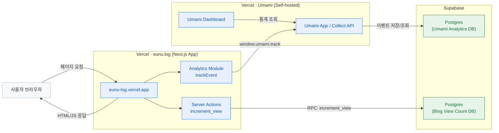

<div align="center">

# eunu.log

[](https://nextjs.org/)
[](https://www.typescriptlang.org/)

개인 블로그예요!

[Live Demo](https://eunu-log.vercel.app)

</div>

## 🛠 Tech Stack

<table>
<tr>
<td align="center" width="96">

<br>Next.js 16+
</td>
<td align="center" width="96">

<br>React 19+
</td>
<td align="center" width="96">

<br>TypeScript 5.0+
</td>
<td align="center" width="96">

<br>Three.js
</td>
<td align="center" width="96">

<br>Tailwind CSS
</td>
</tr>
</table>

**Core:**

- **Framework:** Next.js 16+ (App Router, SSG/SSR)
- **Language:** TypeScript (Strict Mode)
- **Styling:** Tailwind CSS + CSS Variables (with selective CSS Modules)

**Animation:**

- **3D:** Three.js + @react-three/fiber + @react-three/drei
- **Motion:** Framer Motion

**Content:**

- **Format:** MDX + `meta.json` (folder-based content)
- **Processing:** `@mdx-js/loader` + remark/rehype + syntax highlighting

<br />

## 📂 Project Structure

```
eunu.log/
├── 📁 src/
│   ├── 📁 app/                 # Route entry only (Next App Router)
│   ├── 📁 core/                # App-level config/provider composition
│   ├── 📁 domains/             # Domain contracts/types/schema
│   ├── 📁 features/            # Feature modules (ui/model/services)
│   │   ├── 📁 blog/
│   │   ├── 📁 resume/
│   │   ├── 📁 search/
│   │   └── 📁 home/
│   ├── 📁 shared/              # Reusable modules (analytics/integrations/layout/seo/testing/ui/types)
│   ├── 📁 components/
│   │   └── 📁 visualization/   # Interactive algorithm visualizations (kept separately)
│   └── 📁 styles/              # Global styles & tokens
├── 📁 tests/
│   └── 📁 e2e/                 # Centralized Playwright suites
├── 📁 internal/
│   ├── 📁 config/              # Internal lint/spell configuration
│   └── 📁 scripts/             # Internal automation/utility scripts
├── 📁 posts/                    # Blog posts (MDX + metadata)
│   └── 📁 [slug]/              # Each post in its own folder
│       ├── index.mdx           # Post content
│       └── meta.json           # Post metadata
├── 📁 public/                  # Static assets
└── 📁 docs/                    # Documentation
```

<br />

## 🏗 System Architecture

현재 운영 기준 아키텍처는 아래와 같아요.



핵심 포인트예요:

- 블로그 앱(`eunu.log`)과 분석 대시보드(`Umami`)는 각각 Vercel에 분리 배포돼요.
- 블로그 코드에서는 `NEXT_PUBLIC_UMAMI_URL`, `NEXT_PUBLIC_UMAMI_WEBSITE_ID`만 설정하면 Umami 스크립트가 자동으로 로드돼요.
- Umami 커스텀 이벤트는 스크립트 초기화 전에는 큐잉되고, 로드 완료 후 자동으로 flush 돼요.

<br />

## 🚀 Getting Started

### Prerequisites

- Node.js 18+
- npm or yarn

### Installation

```bash
# Clone the repository
git clone https://github.com/dev-wooyeon/eunu.log.git

# Navigate to the project
cd eunu.log

# Install dependencies
npm install
```

### Supabase Setup (View Count)

```bash
cp .env.example .env.local
```

`.env.local`에 아래 값을 채워주세요.

- `NEXT_PUBLIC_SUPABASE_URL`
- `NEXT_PUBLIC_SUPABASE_ANON_KEY`
- `SUPABASE_URL`
- `SUPABASE_SERVICE_ROLE_KEY`

Supabase SQL Editor에서 `docs/database/supabase-view-count.sql`을 실행하면
조회수 집계를 위한 테이블/정책/함수가 생성돼요.

### Development

```bash
# Start development server
npm run dev  # alias: npm run serve
```

브라우저에서 [http://localhost:3000](http://localhost:3000)을 열어 확인해 주세요.

### Environment Variables (Analytics)

`.env.local`에 아래 값을 설정하면 Umami가 동작해요.

```bash
# Umami (self-hosted)
NEXT_PUBLIC_UMAMI_URL=https://your-umami.vercel.app
NEXT_PUBLIC_UMAMI_WEBSITE_ID=your-website-id
```

참고: Umami `<script>` 태그를 각 페이지에 수동 삽입할 필요 없이,
루트 레이아웃의 `UmamiAnalytics` 컴포넌트에서 자동으로 주입돼요.

### Build

```bash
# Create production build
npm run build

# Start production server
npm run start
```

### Ops Docs

- PR 운영 가이드: `docs/guides/pr-workflow.md`
- UI 컴포넌트 가이드: `docs/guides/ui-components-guide.md`
- 주간 KPI 리포트 템플릿: `docs/analytics/analytics-kpi-weekly-template.md`

<br />

## 🎨 Design System

### Color Palette

| Mode    | Background                | Text                 | Accent                 |
| ------- | ------------------------- | -------------------- | ---------------------- |
| ☀️ Light | `#EAEBEA` Newspaper Beige | `#1A1A1A` Soft Black | `#0066CC` Classic Blue |

### Typography

- **Font Family:** Pretendard (Base), JetBrains Mono (Code/Mono), TossFace (Emoji)
- **Scale:** Minor Third Scale (TDS Standard)

<br />

## ✨ Key Features (New)

- **TDS Integration**: Applied Toss Design System tokens (Colors, Spacing, Typography).
- **Interactive Scroll Hint**: Clickable arrow button with smooth scrolling.
- **Glassmorphism**: "True Black Glass" effect on navigation elements.
- **Layout Stability**: "Invisible Reservation" pattern to prevent layout shifts during typing effects.

## 📈 Performance

| Metric    | Target  | Status |
| --------- | ------- | ------ |
| LCP       | < 2.5s  | ✅      |
| FID       | < 100ms | ✅      |
| CLS       | < 0.1   | ✅      |
| Animation | 60fps   | ✅      |

<br />

## 📝 Writing a Post

1. `/posts` 디렉토리에 slug 이름으로 폴더를 생성해요 (예: `2025-01-20-my-post`).
2. 폴더 내에 `meta.json` 파일을 생성해요:

```json
{
  "title": "포스트 제목",
  "slug": "2025-01-20-my-post",
  "description": "간단한 설명",
  "date": "2025-01-20",
  "category": "Dev",
  "tags": ["Tag1", "Tag2"]
}
```

3. 폴더 내에 `index.mdx` 파일을 만들고 Markdown으로 내용을 작성해요.
4. 자동으로 피드 목록에 표시돼요.

<br />

---

<div align="center">

**[⬆ Back to Top](#eunulog)**

</div>
