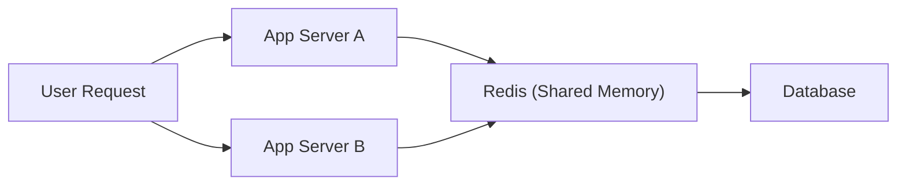

## 1. 개요

캐시는 빠릅니다. 하지만 분산 환경에서 로컬 캐시만으로 확장하면 정합성 비용이 커집니다.
이 글은 로컬 캐시가 만드는 구조적 한계를 정리하고, Redis를 공유 메모리 계층으로 도입해야 하는 기술적 근거를 설명합니다.

---

## 2. 문제 정의: 분산 환경에서 로컬 캐시가 만드는 기술 부채

### 2.1 서버별 메모리 분리로 인한 데이터 불일치

각 서버는 독립된 힙 메모리를 사용합니다. A 서버에서 갱신한 재고가 B 서버에 반영되지 않으면, 사용자는 결제 시점에 품절 오류를 만납니다.
이 문제는 단순 성능 이슈가 아니라 비즈니스 신뢰도 문제입니다.

### 2.2 중복 적재에 따른 메모리 비효율

전역 공지, 공통 코드, 동일 조회 데이터가 서버 수만큼 중복 적재됩니다.
인스턴스가 늘어날수록 인프라 차원의 메모리 효율은 급격히 나빠집니다.

### 2.3 Cache Cold Start가 만드는 연쇄 장애

배포나 재시작 직후 캐시는 비어 있습니다. 이때 모든 요청이 DB로 몰리면 커넥션 풀이 빠르게 고갈되고, 서비스 전체 지연이 커집니다.

---

## 3. 해결책: Redis를 공유 메모리 계층으로 두는 이유

### 3.1 중앙 집중형 접근으로 정합성 확보

모든 애플리케이션 인스턴스가 동일한 Redis 엔드포인트를 조회하면, 데이터 기준점을 한 곳으로 모을 수 있습니다.
이 방식은 분산 환경에서 일관된 읽기/쓰기 흐름을 설계하는 데 유리합니다.

### 3.2 Persistence로 캐시의 휘발성 리스크 완화

Redis는 메모리 기반이지만 디스크 영속화 전략을 제공합니다.

- `RDB`: 시점 스냅샷 저장, 복구 속도에 유리
- `AOF`: 쓰기 명령 로그 기반, 데이터 손실 최소화에 유리

### 3.3 싱글 스레드 이벤트 루프와 원자적 연산

Redis 명령은 단일 스레드 이벤트 루프에서 순차 처리됩니다.
동일 키에 대한 경쟁 연산(`INCR`, `DECR`, `SETNX`)에서도 락 복잡도를 낮추면서 일관된 결과를 얻을 수 있습니다.

---

## 4. 의사결정 가이드

| 비교 항목 | Local Cache (In-process) | Remote Cache (Redis) |
| --- | --- | --- |
| I/O 오버헤드 | 매우 낮음 | 네트워크 왕복 비용 존재 |
| 데이터 정합성 | 서버별 편차 발생 가능 | 전역 기준점 유지 가능 |
| 수평 확장성 | 불리함 | 유리함 |
| 운영 복잡도 | 낮음 | Redis 운영 포인트 필요 |
| 적합한 사례 | 변경 적은 참조 데이터 | 세션, 재고, 랭킹, 공유 상태 |

---

## 5. 도입 체크리스트

1. 서버가 2대 이상으로 확장되고 있는가?
2. 사용자 관점에서 데이터 불일치가 비즈니스 손실로 이어지는가?
3. 배포/재시작 시 DB 스파이크가 반복되는가?
4. 원자적 카운팅 또는 분산 락이 필요한가?

위 질문 중 2개 이상이 Yes라면 Redis를 우선 검토할 시점입니다.

