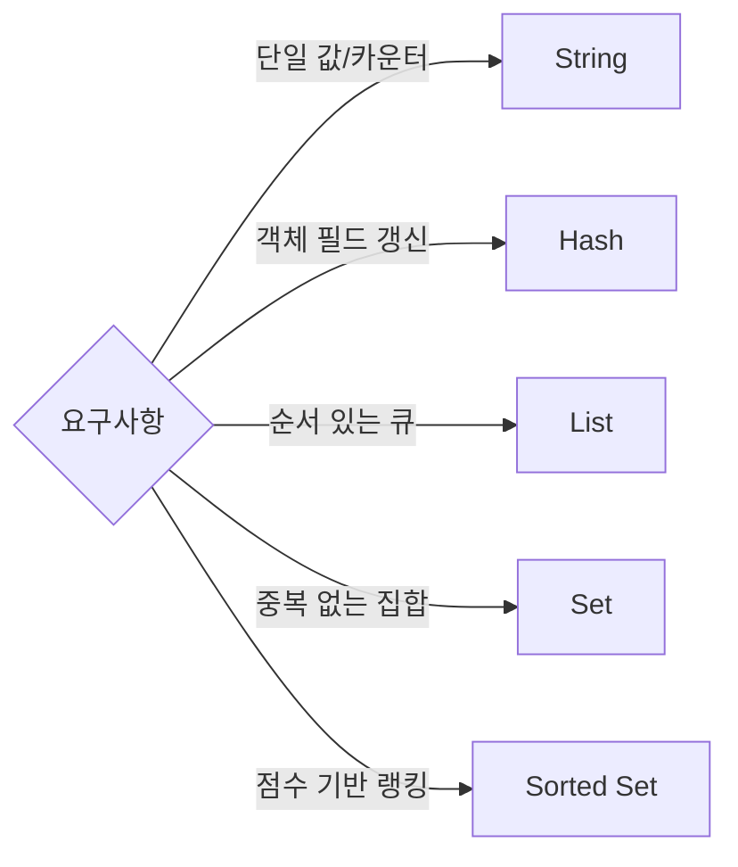

## 1. 개요

Redis를 Key-Value 저장소로만 보면 절반만 사용한 것입니다.
핵심은 데이터 요구사항에 맞는 자료형을 선택해 메모리 사용량과 연산 복잡도를 함께 최적화하는 데 있습니다.

---

## 2. 문제 정의: 모든 데이터를 String으로 저장할 때의 비용

### 2.1 필드 하나 수정에도 전체 객체 재기록

`JSON.stringify()`로 저장한 객체는 작은 수정에도 전체 Read-Modify-Write가 필요합니다.
결과적으로 네트워크 트래픽과 CPU 파싱 비용이 함께 증가합니다.

### 2.2 자료구조 최적화 기회 상실

데이터 특성에 맞는 타입을 쓰지 않으면 Redis 내부 인코딩 최적화를 활용하기 어렵습니다.
같은 정보라도 메모리 사용량과 처리량 차이가 크게 납니다.

---

## 3. 해결책: 5대 자료형과 실무 적용 포인트

### 3.1 String

단일 값 캐싱, 카운터, 토큰 저장에 적합합니다.
`INCR` 같은 원자적 연산이 필요할 때 가장 단순하고 강력합니다.

### 3.2 Hash

객체 필드 단위 수정이 가능한 타입입니다.
프로필/설정처럼 필드가 많은 데이터에서 메모리 효율과 수정 효율이 좋습니다.

### 3.3 List

양끝 삽입/삭제가 빠릅니다.
작업 큐, 타임라인, 최근 이벤트 버퍼에 적합합니다.

### 3.4 Set

중복 없는 멤버십 관리에 최적입니다.
권한 집합, 방문자 집합, 교집합/차집합 연산 시 유용합니다.

### 3.5 Sorted Set

점수(score) 기반 정렬이 필요한 랭킹 시나리오에 필수입니다.
정렬 상태를 유지한 채 범위 조회가 가능합니다.

---

## 4. 의사결정 표

| 자료형 | 대표 사용 사례 | 핵심 명령어 | 평균 복잡도 | 주의사항 |
| --- | --- | --- | --- | --- |
| String | 세션, 토큰, 카운터 | `SET`, `GET`, `INCR` | O(1) | 큰 payload는 네트워크 비용 증가 |
| Hash | 사용자 프로필, 설정 | `HSET`, `HGET`, `HINCRBY` | O(1) | `HGETALL` 남용 시 비용 증가 |
| List | 큐, 타임라인 | `LPUSH`, `RPOP`, `LRANGE` | O(1)~O(N) | 중간 인덱스 접근은 비효율 |
| Set | 멤버십, 중복 제거 | `SADD`, `SISMEMBER`, `SINTER` | O(1)~O(N) | 대형 집합 연산은 부하 점검 필요 |
| Sorted Set | 랭킹, 우선순위 | `ZADD`, `ZRANGE`, `ZREVRANGE` | O(log N) | 대량 삭제/갱신 시 배치 전략 필요 |

---

## 5. 실무 선택 규칙

1. 부분 업데이트가 필요하면 String보다 Hash를 우선 고려합니다.
2. 랭킹 데이터는 애플리케이션 정렬 대신 Sorted Set으로 위임합니다.
3. 중복 여부가 핵심이면 Set을 사용해 애플리케이션 로직을 단순화합니다.
4. 자료형 선택 전 예상 연산(`쓰기/조회/정렬/집합`)의 복잡도를 먼저 계산합니다.

