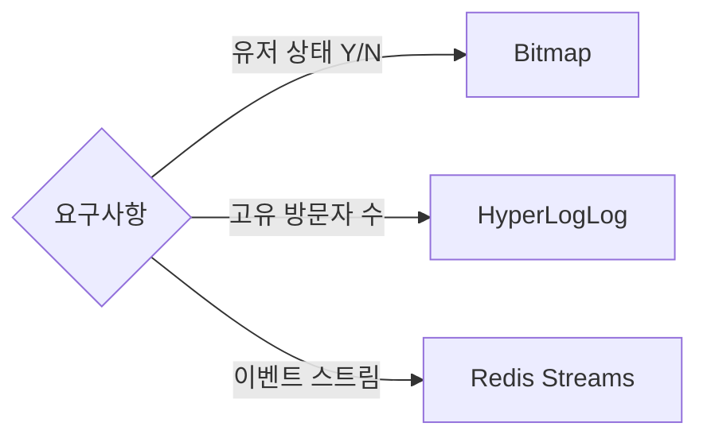

## 1. 개요

대규모 시스템에서 가장 비싼 자원은 보통 메모리입니다.
Redis의 특화 자료형은 정확도, 메모리, 처리량 사이의 트레이드오프를 명확히 선택하게 도와줍니다.

---

## 2. 문제 정의

### 2.1 1억 유저 상태를 저장할 때의 비용

유저별 접속 여부를 일반 구조로 저장하면 메타데이터 오버헤드까지 포함해 메모리가 빠르게 커집니다.

### 2.2 고유 방문자(UV) 집계의 메모리 폭증

정확한 UV를 Set으로 계산하면 대상이 커질수록 메모리 사용량도 선형으로 증가합니다.

### 2.3 메시징 인프라 복잡도 증가

단순 이벤트 전달만 필요한데도 무거운 브로커를 먼저 도입하면 운영 복잡도가 급격히 올라갑니다.

---

## 3. 해결책: Redis 특화 자료형

### 3.1 Bitmaps

비트를 상태값으로 다루는 방식입니다.
유저 ID를 offset으로 사용하면 `SETBIT`, `GETBIT`, `BITCOUNT`로 대규모 상태 집계를 할 수 있습니다.

- 장점: 메모리 효율이 매우 높고 연산이 빠름
- 한계: ID 매핑 전략이 필요하고, sparse 데이터에는 비효율 구간이 생길 수 있음

### 3.2 HyperLogLog

고유 개수(Cardinality) 추정 자료구조입니다.
정확한 목록이 아니라 "대략적인 유니크 수"가 목적일 때 매우 유리합니다.

- 장점: 고정 메모리(약 12KB)
- 한계: 오차(약 0.81%)가 존재하고 개별 ID 조회는 불가

### 3.3 Streams

Redis 기반 이벤트 로그/큐 자료형입니다.
`Consumer Group`을 사용하면 여러 소비자가 병렬로 처리할 수 있습니다.

- 장점: Redis 기반으로 빠른 도입, ACK 기반 처리 가능
- 한계: 초대형 장기 보관/재처리 시나리오는 전용 브로커 대비 한계가 있음

---

## 4. 의사결정 표

| 기술 | 목적 | 메모리 특성 | 정확도 | 대표 명령 |
| --- | --- | --- | --- | --- |
| Bitmaps | 상태 체크 | 비트 단위 저장 | 정확 | `SETBIT`, `BITCOUNT`, `BITOP` |
| HyperLogLog | 유니크 카운팅 | 고정 메모리 | 근사 | `PFADD`, `PFCOUNT`, `PFMERGE` |
| Streams | 이벤트 처리 | 데이터량 비례 | 정확 | `XADD`, `XREADGROUP`, `XACK` |

---

## 5. 실무 체크리스트

1. 정확한 목록이 필요한지, 개수만 필요한지 먼저 구분합니다.
2. 특화 자료형 도입 전, 데이터 수명 주기(TTL/아카이브)를 함께 설계합니다.
3. Streams는 Consumer Group 재처리 정책(`pending`, `claim`)까지 운영 문서화합니다.

