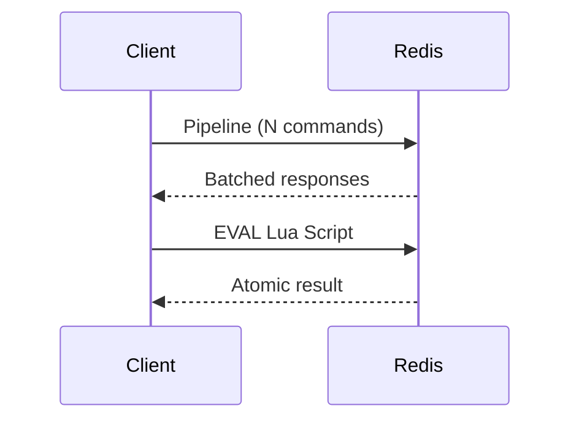

## 1. 개요

Redis 성능 이슈의 상당수는 엔진 자체보다 네트워크 왕복(RTT)에서 시작합니다.
이 글은 대량 처리의 처리량을 높이는 Pipeline과, 조건부 로직의 정합성을 보장하는 Lua 전략을 다룹니다.

---

## 2. 문제 정의

### 2.1 RTT 누적으로 인한 처리량 저하

명령어 1,000개를 순차 요청하면 Redis 실행시간보다 네트워크 대기시간이 더 커지는 경우가 많습니다.

### 2.2 조회-수정 분리 로직의 경쟁 상태

"조회 후 차감" 로직을 애플리케이션에서 분리 호출하면 중간에 다른 요청이 끼어들 수 있습니다.

---

## 3. 해결책

### 3.1 Pipeline: 요청 왕복 횟수 줄이기

여러 명령을 한 번에 전송하고 응답을 한 번에 받습니다.
RTT가 큰 환경일수록 개선 폭이 큽니다.

```bash
# 예시: redis-cli 파이프라이닝
(echo "SET key1 v1"; echo "SET key2 v2"; echo "MGET key1 key2") | redis-cli --pipe
```

### 3.2 Lua Script: 원자적 비즈니스 로직

여러 Redis 명령을 서버 안에서 단일 작업으로 실행합니다.
락 없이도 조건부 연산의 원자성을 확보할 수 있습니다.

```lua
-- 잔액 차감 예시
local balance = tonumber(redis.call('GET', KEYS[1]) or '0')
local amount = tonumber(ARGV[1])

if balance < amount then
  return {err = 'INSUFFICIENT_BALANCE'}
end

redis.call('DECRBY', KEYS[1], amount)
return balance - amount
```



---

## 4. 선택 가이드

| 방식 | 강점 | 약점 | 적합한 시나리오 |
| --- | --- | --- | --- |
| 일반 호출 | 단순 | RTT 누적 | 소량 트래픽 |
| Pipeline | 처리량 향상 | 명령 간 의존성 처리 제한 | 대량 배치 읽기/쓰기 |
| Lua | 원자성 + 왕복 최소화 | 스크립트 복잡도 관리 필요 | 조건부 업데이트, 재고 차감 |
| MULTI/EXEC | 트랜잭션 구조 | 조건 로직 표현 제한 | 단순 트랜잭션 묶음 |

---

## 5. 운영 체크리스트

1. Pipeline 배치 크기를 측정 기반으로 조절합니다.
2. Lua 스크립트는 짧게 유지하고 실행 시간을 모니터링합니다.
3. 응답 지연이 보이면 먼저 네트워크 RTT와 파이프라인 적용 여부를 확인합니다.

