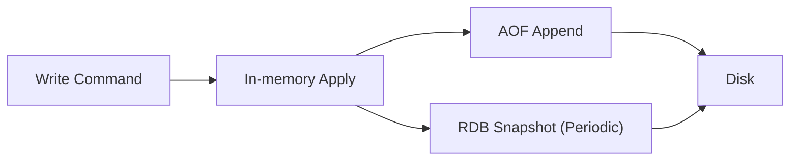

## 1. 개요

Redis는 메모리 기반이라 빠르지만, 장애 시 데이터 유실 리스크를 관리해야 합니다.
핵심은 영속성 설정을 통해 복구속도(RTO)와 유실허용(RPO)을 서비스 요구사항에 맞추는 것입니다.

---

## 2. 문제 정의

### 2.1 디스크 기록은 느리다

모든 쓰기를 즉시 디스크에 반영하면 Redis의 장점인 지연시간이 악화될 수 있습니다.

### 2.2 장애 시 유실 범위를 통제해야 한다

운영 환경에서는 "최대 몇 초 데이터를 잃을 수 있는가"를 명시적으로 결정해야 합니다.

---

## 3. 해결책

### 3.1 RDB 스냅샷

주기적으로 메모리 상태를 파일로 저장합니다.
복구가 빠르고 백업 파일 관리가 쉽습니다.

### 3.2 AOF 로그

쓰기 명령을 로그로 남깁니다.
`appendfsync` 정책에 따라 내구성과 성능 밸런스를 조절할 수 있습니다.

### 3.3 하이브리드 운영

실무에서는 RDB + AOF를 함께 사용해 복구속도와 안전성을 동시에 확보하는 경우가 많습니다.



```conf
# 예시 (redis.conf)
save 900 1
save 300 10
save 60 10000
appendonly yes
appendfsync everysec
```

---

## 4. RDB vs AOF

| 항목 | RDB | AOF |
| --- | --- | --- |
| 복구 속도 | 빠름 | 상대적으로 느림 |
| 데이터 안전성 | 스냅샷 간격만큼 유실 가능 | fsync 정책에 따라 유실 최소화 |
| 파일 크기 | 상대적으로 작음 | 상대적으로 큼 |
| 운영 포인트 | 스냅샷 타이밍 | rewrite 및 디스크 I/O |

---

## 5. 운영 체크리스트

1. 서비스별 RPO/RTO 목표를 먼저 정의합니다.
2. AOF rewrite 시점과 디스크 용량 알람을 설정합니다.
3. `fork()` 시 메모리 급증 가능성을 고려해 여유 메모리를 확보합니다.

