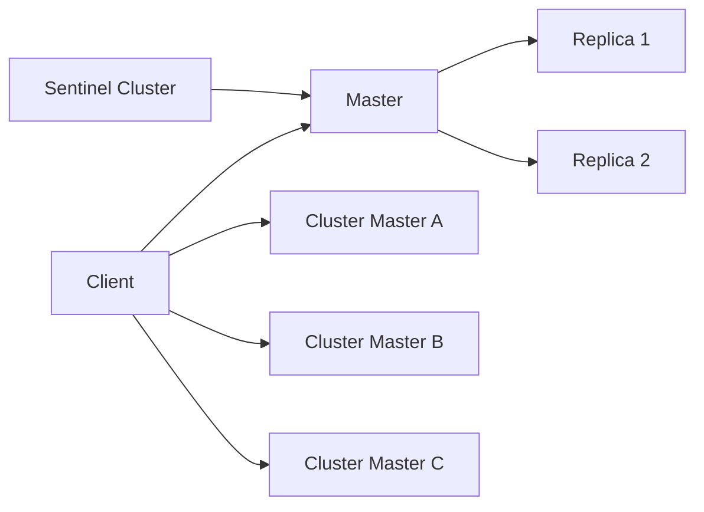

## 1. 개요

운영 환경에서 Redis 한 대는 결국 단일 장애점이 됩니다.
가용성은 Replication/Sentinel로, 대규모 확장성은 Cluster로 해결합니다.

---

## 2. 문제 정의

### 2.1 장애 한 번에 전체 중단

단일 노드 장애가 즉시 캐시 레이어 장애로 이어집니다.

### 2.2 데이터와 쓰기 부하가 한 노드 한계 초과

메모리와 CPU 한계에 도달하면 수직 확장만으로는 비용 대비 효율이 급격히 떨어집니다.

---

## 3. 해결책

### 3.1 Replication + Sentinel

- Master/Replica 복제로 읽기 부하를 분산
- Sentinel이 장애를 감시하고 자동 페일오버 수행

### 3.2 Redis Cluster

- 16,384 해시 슬롯 기반 샤딩
- 노드별 데이터 분산으로 저장 용량/쓰기 처리량 확장

---

## 4. 선택 기준

| 기준 | Replication + Sentinel | Redis Cluster |
| --- | --- | --- |
| 주 목적 | 고가용성 | 고가용성 + 수평 확장 |
| 데이터 배치 | 전체 복제 | 샤딩 분산 |
| 난이도 | 비교적 낮음 | 높음 |
| 읽기 확장 | 우수 | 우수 |
| 쓰기 확장 | 제한적 | 우수 |

---

## 5. 운영 체크리스트

1. Sentinel/Cluster 모두 홀수 노드 기반 quorum 설계를 유지합니다.
2. 키 설계 단계에서 hot key를 방지하도록 해시 분포를 검증합니다.
3. 클라이언트 라이브러리의 cluster redirect 지원 여부를 반드시 확인합니다.

