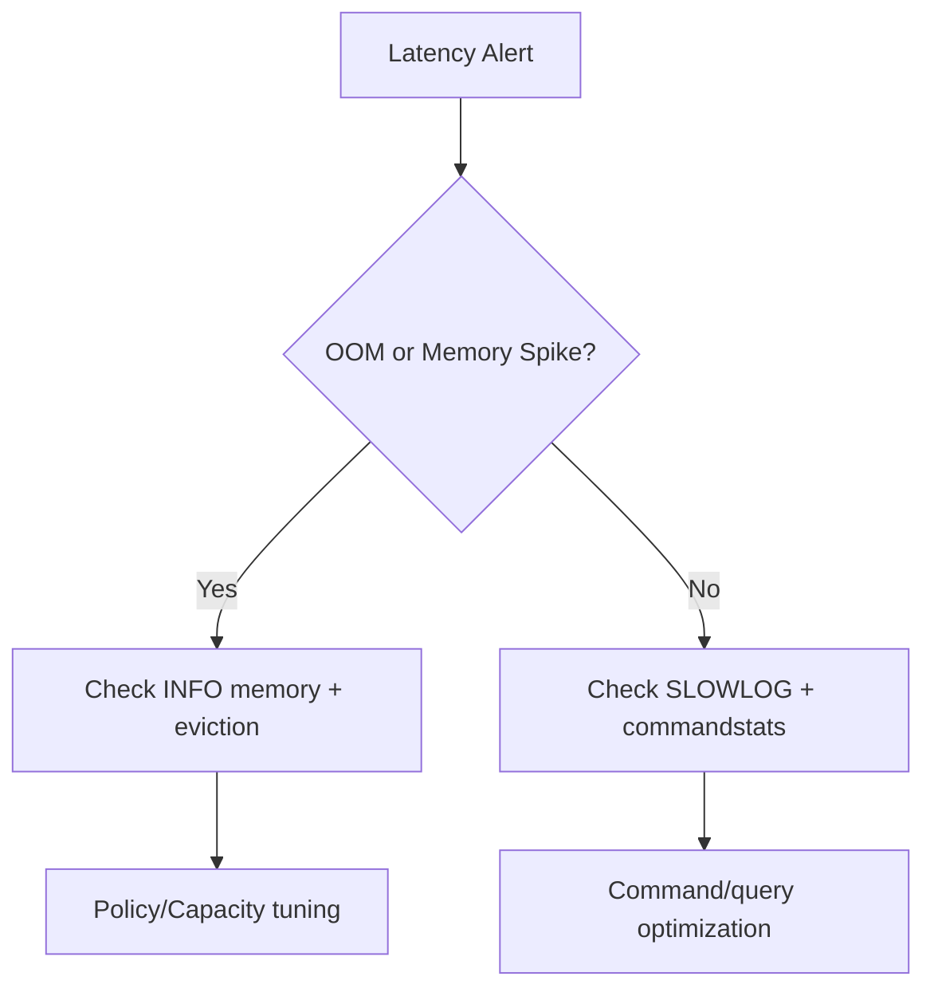

## 1. 개요

Redis 운영의 핵심은 "빠른 장애 복구"가 아니라 "장애 예방"입니다.
메모리 정책과 지표 기반 점검 루틴이 없으면 OOM과 지연 급증이 반복됩니다.

---

## 2. 문제 정의

### 2.1 maxmemory 도달 시 쓰기 장애

정책이 잘못되면 Redis는 새 쓰기를 거부하거나 중요한 키를 예기치 않게 삭제합니다.

### 2.2 지연 시간 급증 원인 파악 어려움

싱글 스레드 모델에서는 무거운 명령 한 번이 전체 응답 시간에 영향을 줍니다.

---

## 3. 해결책

### 3.1 Eviction 정책 설계

- `allkeys-lru`, `volatile-lru`, `allkeys-lfu` 등 정책을 서비스 특성에 맞춰 선택
- TTL 없는 키가 많다면 `volatile-*` 정책만으로는 문제를 해결할 수 없음

### 3.2 핵심 지표 모니터링

`INFO memory`, `INFO stats`, `INFO commandstats`를 주기적으로 수집합니다.

- `used_memory`, `used_memory_rss`
- `mem_fragmentation_ratio`
- `evicted_keys`, `expired_keys`

### 3.3 느린 명령 추적

`SLOWLOG GET`으로 느린 명령을 파악합니다.
`KEYS *`, 대규모 `HGETALL` 같은 O(N) 패턴을 우선 제거합니다.

---

## 4. 장애 대응 플레이북

| 증상 | 1차 확인 | 2차 확인 | 대응 |
| --- | --- | --- | --- |
| OOM 에러 | `used_memory` | `maxmemory-policy` | 정책 조정, 용량 증설 |
| 응답 지연 | `SLOWLOG` | `commandstats` | 느린 명령 대체/분할 |
| 파편화 증가 | `mem_fragmentation_ratio` | RSS 추이 | purge/재기동 전략 |
| 키 유실 | `evicted_keys` | TTL 정책 | 키 우선순위 재설계 |

---

## 5. 운영 체크리스트

1. 메모리 상한은 피크 사용량 대비 여유를 두고 설정합니다.
2. 대용량 키와 hot key를 정기적으로 스캔해 분산 전략을 검토합니다.
3. 장애 후 재현 가능한 회고 문서를 남겨 동일 이슈 재발을 막습니다.

