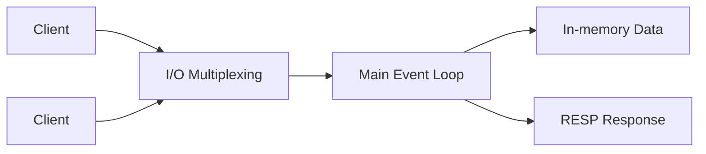

## 1. 개요

Redis는 싱글 스레드 모델인데도 높은 처리량을 보입니다.
핵심은 I/O multiplexing, 이벤트 루프, 단순한 프로토콜(RESP)의 조합입니다.

---

## 2. 문제 정의

### 2.1 왜 멀티스레드가 아닌가

멀티스레드는 락 경합과 컨텍스트 스위칭 비용을 동반합니다.
Redis는 데이터 명령 실행을 단일 흐름으로 유지해 이 비용을 줄입니다.

### 2.2 수많은 연결을 어떻게 처리하는가

수천~수만 커넥션을 블로킹 I/O로 처리하면 스레드 자원이 빠르게 고갈됩니다.

---

## 3. 해결책

### 3.1 Event Loop + I/O Multiplexing

`epoll`/`kqueue` 기반으로 읽기 가능한 소켓만 선택 처리합니다.
하나의 메인 루프에서 명령을 순차 실행해 락 복잡도를 줄입니다.

### 3.2 RESP 프로토콜

Redis Serialization Protocol은 간단하고 파싱이 빠른 텍스트 기반 프로토콜입니다.
네트워크 오버헤드를 낮추고 다양한 언어 클라이언트 구현을 단순화합니다.

```text
*2
$3
GET
$5
mykey
```

```text
$5
value
```

### 3.3 CoW 기반 백그라운드 작업

RDB/AOF rewrite에서 `fork()` 후 Copy-on-Write를 활용해 메인 처리 흐름을 최대한 보존합니다.



---

## 4. 내부 구조를 고려한 최적화 포인트

| 내부 특성 | 리스크 | 실무 대응 |
| --- | --- | --- |
| Single command loop | 긴 명령이 전체 지연 유발 | O(N) 명령 최소화 |
| Event loop | CPU 집중 작업에 취약 | 무거운 Lua/대량 작업 분할 |
| RESP | 요청 수가 많으면 RTT 부담 | Pipeline/배치 적용 |
| CoW | fork 시 메모리 급증 가능 | 메모리 헤드룸 확보 |

---

## 5. 마무리

1. Redis의 강점은 단순한 실행 모델을 극한까지 최적화한 데 있습니다.
2. 내부 구조를 이해하면 장애 원인 추적과 튜닝 속도가 빨라집니다.
3. Redis를 만능으로 쓰기보다, 요구사항별로 다른 저장소와 조합해야 장기적으로 안정적입니다.

